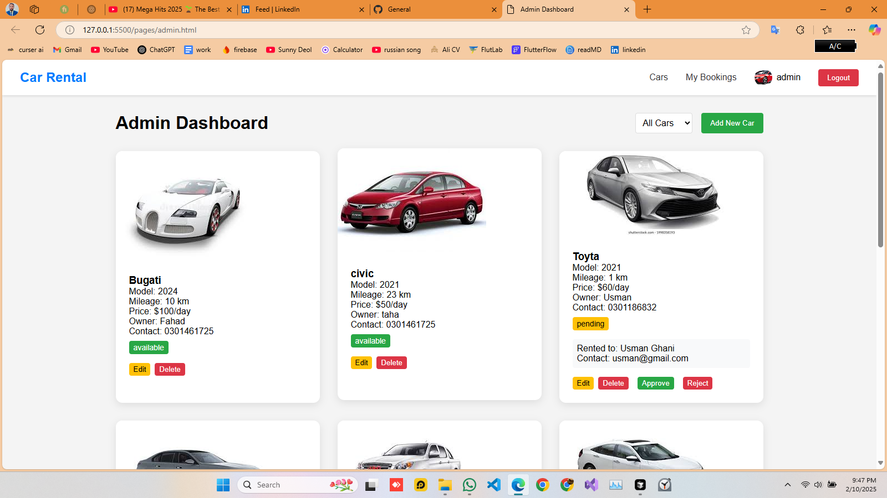

<div align="center">
      <h1> <br/>Car Rental Admin Dashboard</h1>
      <h3>Modern Car Rental Management System</h3>
</div>

<p align="center">
    <a href="https://your-demo-url.com" target="_blank">
        
    </a>
    <a href="https://your-facebook-url.com" target="_blank">
        
    </a>
    <a href="https://your-linkedin-url.com" target="_blank">
        
    </a>
</p>

# 📌 Overview

A comprehensive car rental management system with separate interfaces for administrators and users. Built with modern web technologies, this system provides an intuitive platform for managing car rentals, user bookings, and administrative tasks.

# 🛠️ Tech Stack


## 📸 Screenshots

### Admin Interface

<div align="center">
  
  <p><em>Comprehensive admin control panel</em></p>
</div>

### User Management

<div align="center">
  
  <p><em>User management interface</em></p>
</div>

## Demo Credentials

### Admin Account

- Email: admin@gmail.com
- Password: 123
- Role: Administrator (role_of_user: 1)

### Demo User Account

- Email: demo@gmail.com
- Password: 123
- Role: Standard User (role_of_user: 2)

## 🚀 Key Features

### User Management

- Role-based authentication system
- User registration and login
- Profile management with image upload
- Secure password handling

### Car Management (Admin)

- Add new cars to the fleet
- Edit car details and availability
- Delete cars from the system
- Monitor car status and rentals
- Approve/reject rental requests

### Booking System (Users)

- Browse available cars
- Submit rental requests
- View booking status
- Cancel bookings
- Return rented cars

### Admin Controls

- Complete user management dashboard
- Car fleet management
- Rental request approval system
- Status monitoring and updates

### Additional Features

- Real-time status updates
- Interactive notifications
- Responsive design
- User-friendly interface
- Form validation
- Secure authentication

## Project Structure

```
├── index.html
├── js/
│   ├── admin.js         # Admin dashboard functionality
│   ├── admin-users.js   # User management for admins
│   ├── auth.
```
